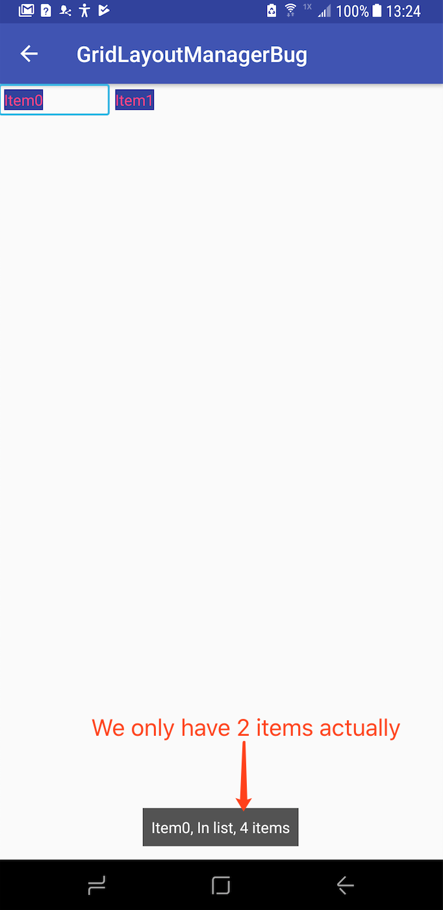
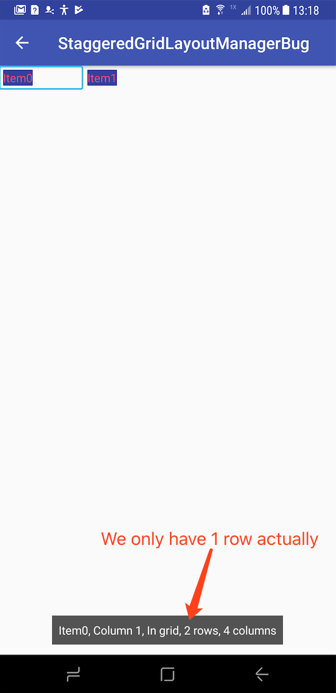

# AndroidBugs

## GridLayoutManagerBug

There is a bug when RecyclerView use GridLayoutManager as the LayoutManager shows as below:
final GridLayoutManager layoutManager = new GridLayoutManager(mContext, columnCount);
mRecyclerView.setLayoutManager(layoutManager);

The announcement happens at the first time focus entered to RecyclerView, if focus already in RecyclerView, it won't happen.

Let’s say if we set spanCount to 4, but we only have 2 items, it will announce “in list, 4 items”, actually we only have 2 items, and actually, we use "grid" not "list", the bug not exist if itemCount >= spanCount.
If itemCount > spanCount, let say itemCount equals 6 in this case, it will announce “in grid, 6 items” which is correct.

Here is the screenshots show what happens

Add description for screenshot (the original one is present at GridLayoutManagerBug.png):

## StaggeredGridLayoutManagerBug

There is a bug when RecyclerView use StaggeredGridLayoutManager as the LayoutManager shows as below:
final StaggeredGridLayoutManager layoutManager = new StaggeredGridLayoutManager(
                columnCount,
                StaggeredGridLayoutManager.VERTICAL);
mRecyclerView.setLayoutManager(layoutManager);

The announcement happens at the first time focus entered to RecyclerView, if focus already in RecyclerView, it won't happen.

Let’s say if we set spanCount to 4, and we have 6 items, it will announce "In grid, 6 rows, 4 columns", actually there is only 2 rows.

Add description for screenshot (the original one is present at StaggeredGridLayoutManagerBug.png):

